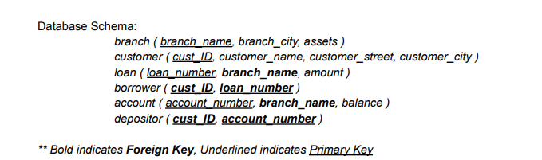

# Banking Database Design

## Objective

For this project, I utilize the skills I have acquired in DTSC660 Data and Database Management with SQL to create and design a database in PgAdmin and write complex sql queries to answer the business questions listed in the "instructions" PDF.

## Part 1: Database Design

Asked to create a banking database for Eastern Banking Holdings. In this part the objective is to create a comprehensive DDL for the banking database. 
Employ methods such as defining primary and foreign keys, implementing various constraints, and ensuring data integrity.

## Part 2: Queries Using the Banking Database

Populate the banking database with the provided data then write a series of complex queries that involve techniques such as JOINS, SET operators, and Subqueries.

## Part 3: Advanced Queries with the University Database

Utilize the university database and write another series of advanced queries incorporating various concepts and techniques to help answer the questions in the instructions PDF.

